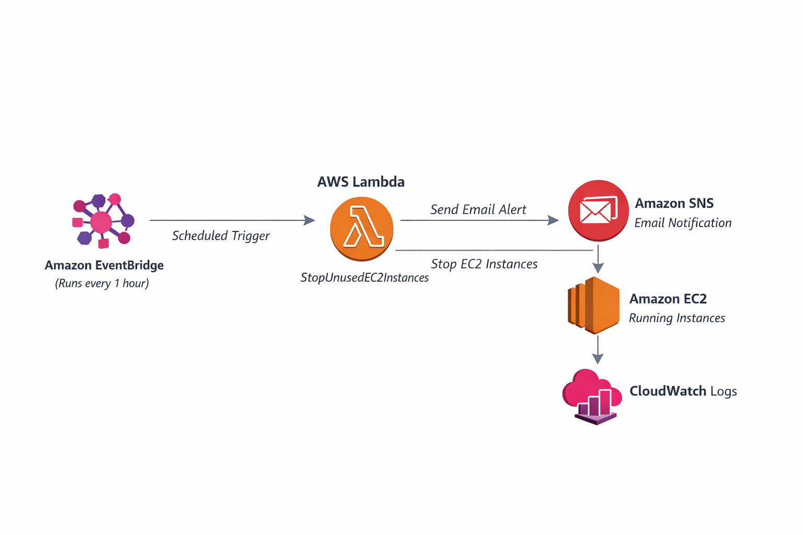

# AWS Cost Optimization using Lambda & SNS
---

## 🏗️ Architecture Diagram

## 🏗️ Architecture Diagram

## 📌 Project Overview
This project automatically stops unused EC2 instances to reduce AWS costs.
Before stopping instances, an email alert is sent using Amazon SNS.

## 🛠️ Services Used
- AWS Lambda
- Amazon EC2
- Amazon SNS
- Amazon EventBridge
- AWS IAM
- Amazon CloudWatch

## 🔁 Architecture Flow
1. EventBridge triggers Lambda every hour
2. Lambda checks running EC2 instances
3. SNS sends email alert
4. Lambda stops EC2 instances
5. Logs are stored in CloudWatch

## 🧠 Use Case
- Cost optimization
- Avoid unnecessary EC2 billing
- Automated infrastructure control

## 🔐 IAM Permissions
- EC2 Full Access
- SNS Publish Access
- CloudWatch Logs

  ## ⚙️ Implementation Steps

### Step 1: Create IAM Role
- Create IAM role for Lambda
- Attach policies:
  - AmazonEC2FullAccess
  - AmazonSNSFullAccess
  - CloudWatchLogsFullAccess

---

### Step 2: Create SNS Topic
- Create SNS topic
- Add email subscription
- Confirm email subscription

---

### Step 3: Create Lambda Function
- Runtime: Python 3.x
- Attach IAM role
- Add boto3-based Python code

---

### Step 4: Add Lambda Code
- Fetch running EC2 instances
- Send SNS email alert
- Stop EC2 instances

---

### Step 5: Create EventBridge Rule
- Create scheduled rule
- Run every 1 hour
- Set Lambda as target

---

### Step 6: Testing & Verification
- Manually start EC2 instance
- Trigger Lambda
- Verify:
  - Email alert received
  - EC2 instance stopped
  - Logs in CloudWatch

---

## ✅ Result
- Unused EC2 instances stopped automatically
- Email alert sent before shutdown
- AWS cost optimized

---

## 🚀 Outcome
- Reduced AWS costs
- Fully automated solution
- Email alert before EC2 shutdown

## 📎 Author
**Srushti Deshmukh**  
DevOps / Cloud Engineer
